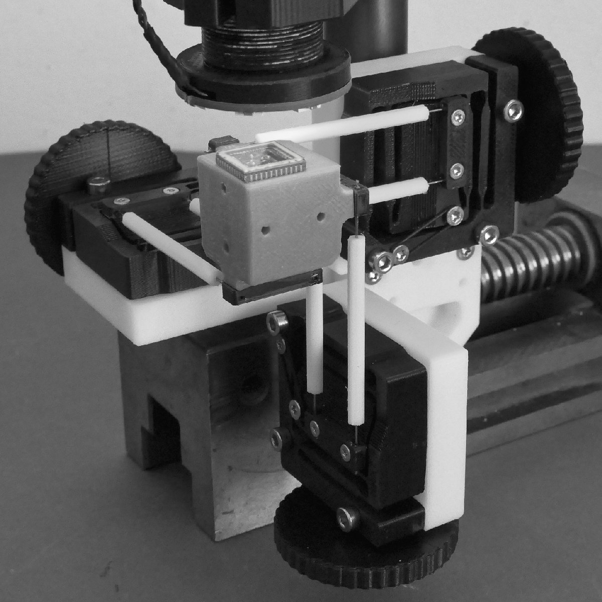

# 3D-Printed Flexure Micro-Manipulator

This project contains am open source low-cost, easy-to-build **XYZ Micro-Manipulator** platform. 

It's designed for applications such as optical alignment, probing electronic components, and microscopy.
Thanks to its parallel kinematic structure and integrated flexures, it achieves good mechanical stiffness for a 3D-printed device, as well as micrometer precision.

    
    

### Build

Ready to print 3d-models can be found here: [examples](print_files/v2).

### Examples

    
    
    

### Contribute

There are some open task for everyone wanting to contribute to this project:

* Create CAD model for imperial units.
* Improve O-Ring Flexure preload mechanism.
* Find an easy way to mount the crank wheels true and without 'wobble' to M3 bolts.

