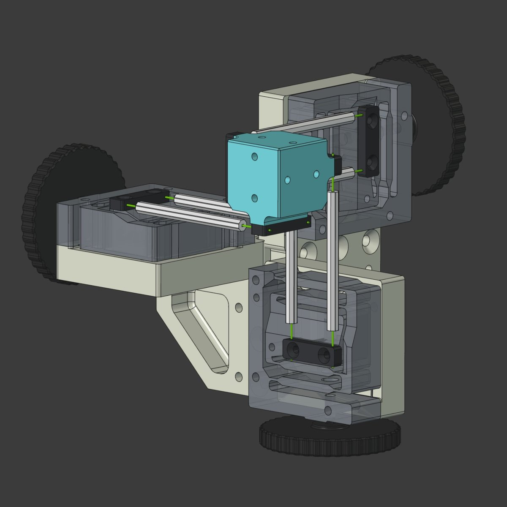
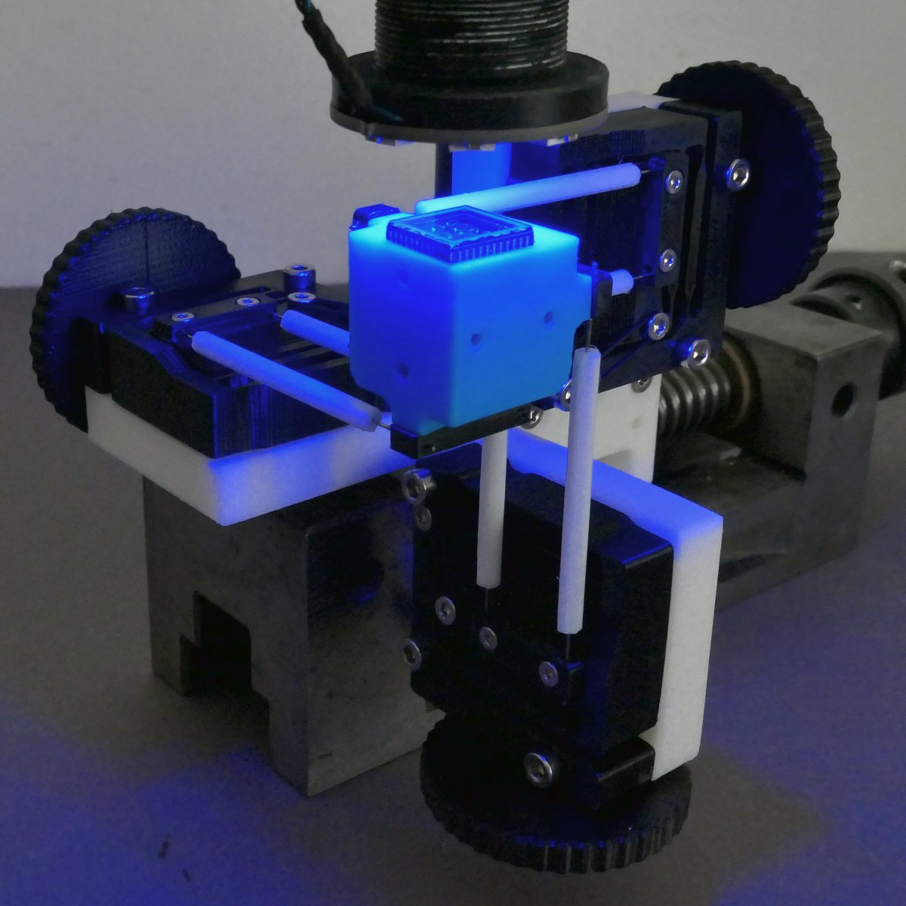
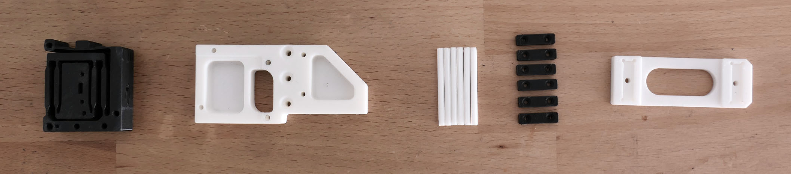
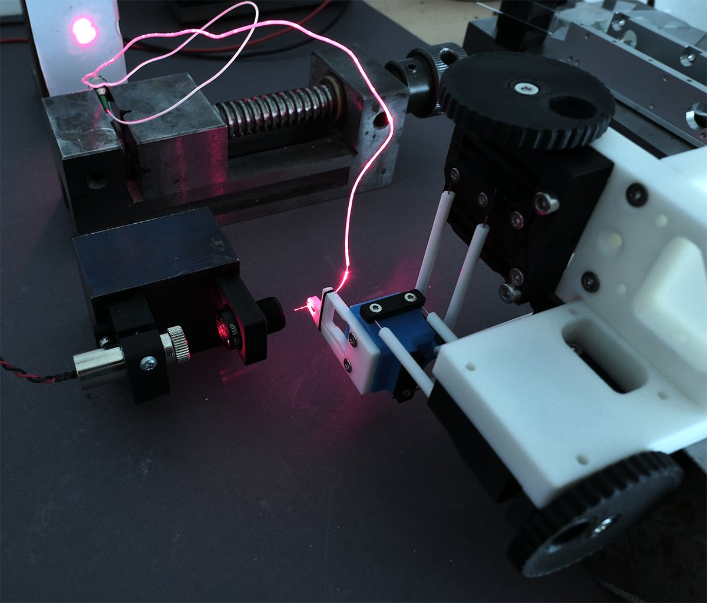
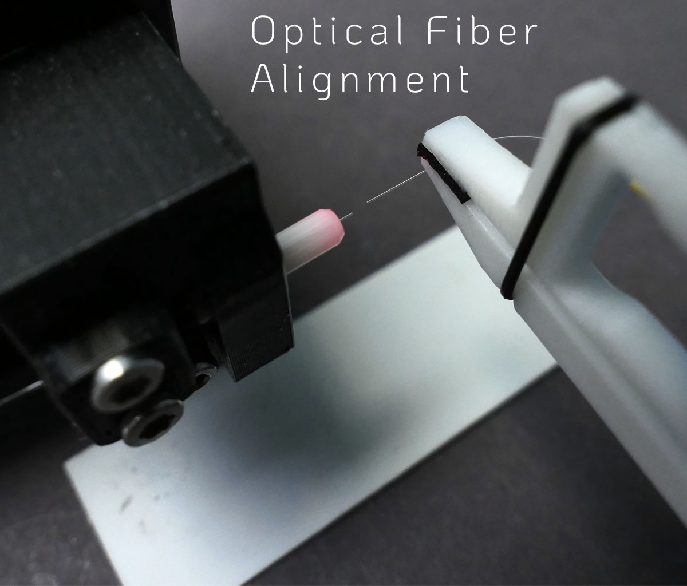
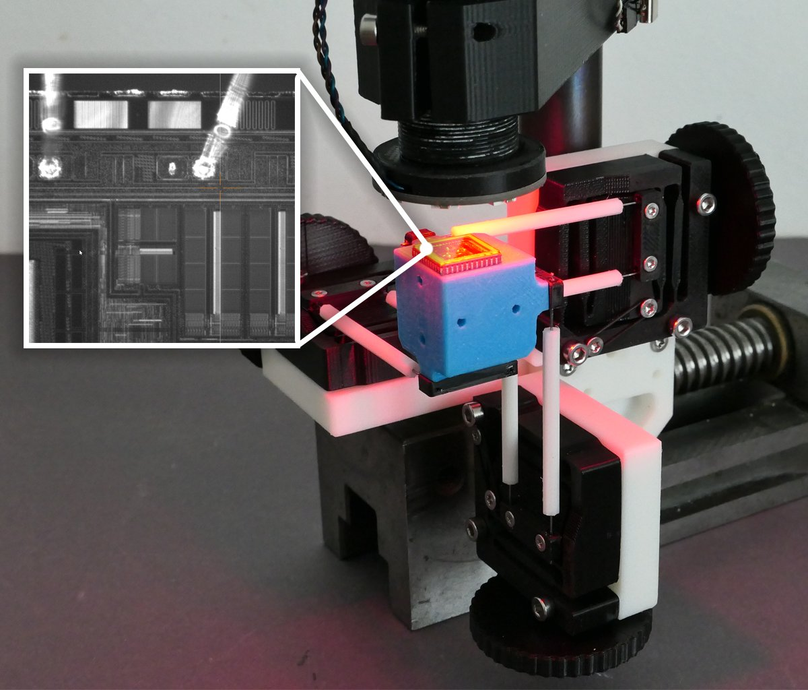
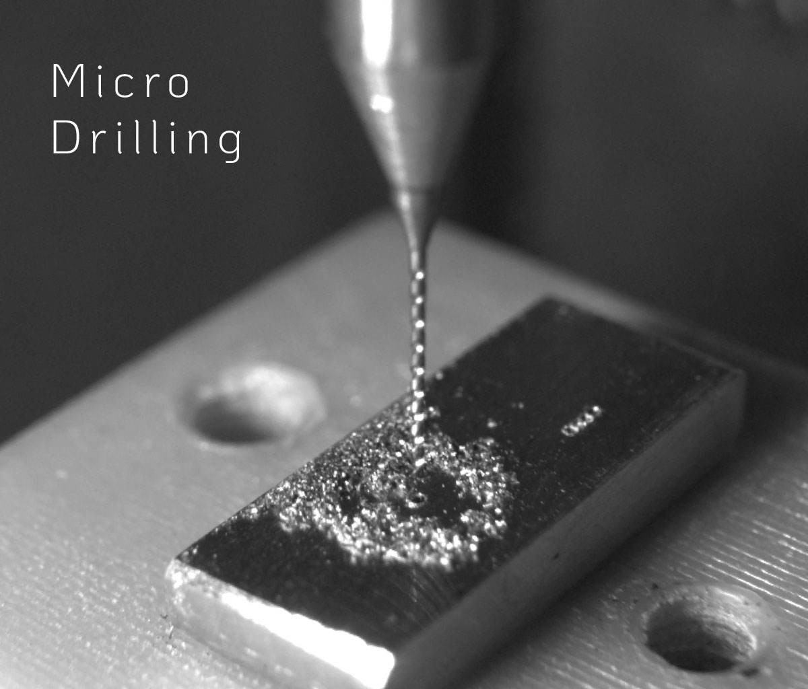

# 3D-Printed Flexure Micro-Manipulator

This project contains am open source low-cost, easy-to-build **XYZ Micro-Manipulator** platform. 

It's designed for applications such as optical alignment, probing electronic components, and microscopy.
Thanks to its parallel kinematic structure and integrated flexures, it achieves good mechanical stiffness for a 3D-printed device, as well as micrometer precision.

    
    

The design was partially inspired by another great open source flexure stage 'The OpenFlexure Block Stage - Sub-100 nm fibre alignment with a monolithic plastic flexure stage' 
  

### ✅ 3D-Printing

Ready to print 3d-models can be found here: [Files for 3D-Printing](print_files/v2).

    

Parts are optimized for 0.4mm print nozzle and PLA. The parts 'WireMount' and 'FlexureStiffener' should be printed at slow speed (25mm/s) and with 0.1mm layerheight to ensure good quality prints.
All other parts can be printed with 0.2mm or 0.25mm layer height and regular speed. The endeffector requires a little bit of support, which is easy to peel of for this simple geometry.

### ✨ Examples

Below you find some examples of the translation stage in action. But there are many more possible usecases to be discovered...

    
    
    
    

### 📄Resources

Here are some great resources and similar projects from which inspiration for this project was drawn.

* [Open Flexure Microscope](https://openflexure.org/projects/microscope/)
* [The OpenFlexure Block Stage](https://arxiv.org/abs/1911.09986).

### 🚀 Contribute 

There are some open task for everyone wanting to contribute to this project:

* Create CAD model for imperial units.
* Improve O-Ring Flexure preload mechanism.
* Find an easy way to mount the crank wheels true and without 'wobble' to M3 bolts.

